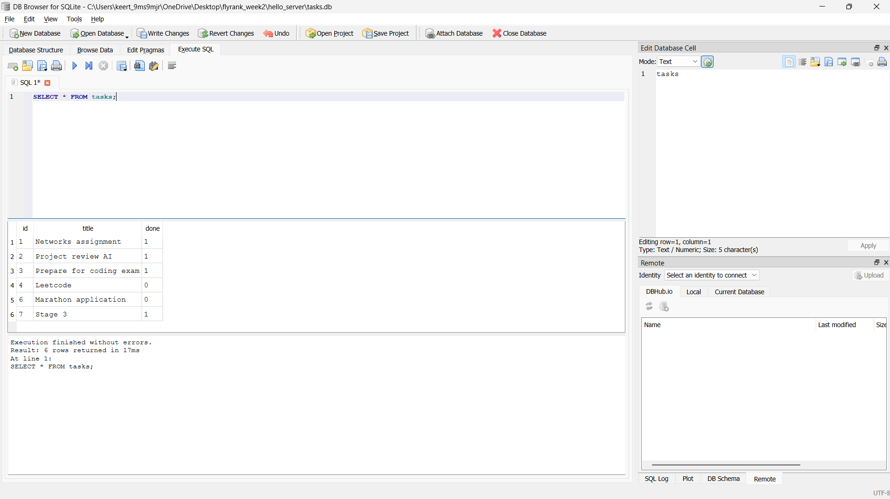
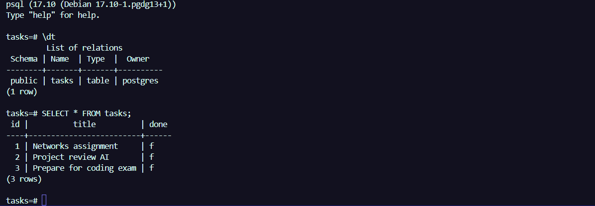

# Task API
A simple CRUD REST API built with *FastAPI* as part of my FlyRank AI Backend Internship(Week 2).

## Features
- Get API information
- Health check endpoint
- View all tasks
- View a task by ID
- Create a new task
- Update an existing task
- Delete a task
- Input validation and HTTP status codes
- Interactive API documentation with Swagger UI

## Tech Stack

- Python
- FastAPI
- Uvicorn
- Pydantic

## Screenshot

## curl.exe output

## SQLite Database

- This project uses SQLite because it is:
A lightweight, file-based database.
Requires zero server setup or installation.
Stores data in a single tasks.db file.

- Database File
The database file is tasks.db.
It is created automatically when the application starts.
If the file does not exist, the application creates it, creates the tasks table, and seeds three example tasks.
tasks.db is usually added to .gitignore so every clone starts with a fresh database.

- Running the Project:
uvicorn main:app --reload

- Link:
http://127.0.0.1:8000/docs

- SQL Query Example:
SELECT COUNT(*) FROM tasks;
Result: Returns the total number of tasks currently stored in the database.

## DB Browser for SQLite Screenshot 

### Storage implementation

The API endpoint tests from Assignment 1 continue to pass after migrating from in-memory storage to SQLite. This proves that storage is an implementation detail because the API contract (routes, request formats, responses, and status codes) remains unchanged while only the data layer changed.

### Index

An index improves query performance by creating a faster lookup structure for frequently searched columns.

# Task API - FastAPI + PostgreSQL + Docker

A CRUD task management API built with FastAPI and PostgreSQL.
The application runs completely through Docker Compose with a single command.

## Run the application

1. Copy environment variables:

cp .env.example .env

2. Start the stack:

docker compose up

## Environment Variables

Create a `.env` file using `.env.example`.

| Variable | Description |
|---|---|
| DATABASE_URL | PostgreSQL connection string |

## API Endpoints

| Method | Endpoint | Description |
|---|---|---|
| GET | / | API information |
| GET | /health | Health check |
| GET | /tasks | Get all tasks |
| GET | /tasks/{id} | Get task by id |
| POST | /tasks | Create task |
| PUT | /tasks/{id} | Update task |
| DELETE | /tasks/{id} | Delete task |

## Example Request

curl -i http://localhost:8000/tasks

## Database

PostgreSQL running inside Docker:

## Database

PostgreSQL running inside Docker:
